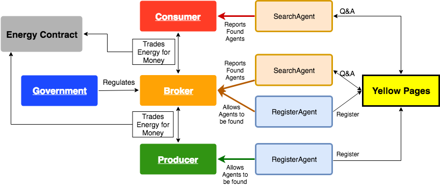
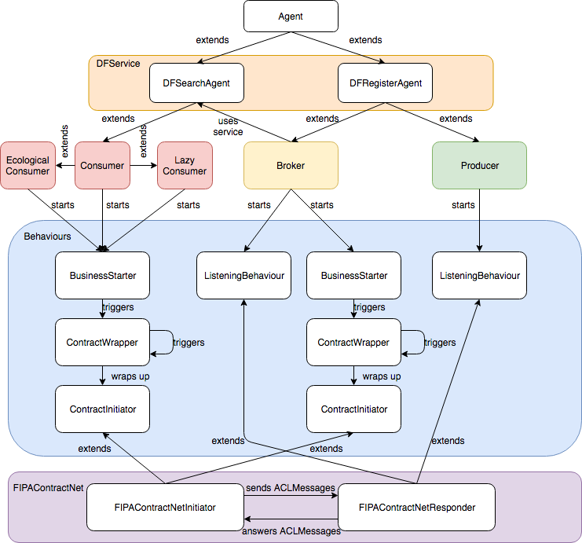

# FEUP-AIAD

Modelling an electricity market with JADE + Repast + Sajas :zap:

### High-level Architecture

### Agent's Behaviours / Strategies

#### Multi-Agent System Slides: [here](docs/AIAD_1_Slides.pdf) and [here](docs/AIAD_1_Slides_Aux.pdf)

#### Data-Mining Slides: [here](docs/AIAD_2_Slides.pdf) and [here](docs/AIAD_2_Slides_Aux.pdf)
Data Mining approach aimed at predicting a Consumer's behaviour class (Normal/Lazy/Ecological) from its previous contracts.

We achieved an accuracy of 85% with a rolling window of the 5 previous contracts (with Gradient Boosted Trees).

### Authors:
* @AndreFCruz
* @EdgarACarneiro
* @xfontes42
